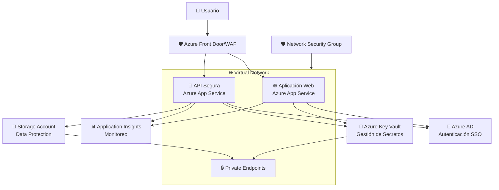

# 🛡️ Aplicación .NET 9 Segura en Azure

Una solución completa en **C# con .NET 9** diseñada para desplegar en **Azure App Service** con implementación de las mejores prácticas de seguridad, incluyendo Azure AD SSO, OAuth2, Azure Key Vault, y arquitectura resiliente.

## 📋 Tabla de Contenidos

- [🎯 Características](#-características)
- [🏗️ Arquitectura](#️-arquitectura)
- [🔧 Prerrequisitos](#-prerrequisitos)
- [⚡ Inicio Rápido](#-inicio-rápido)
- [🔐 Configuración de Seguridad](#-configuración-de-seguridad)
- [🚀 Despliegue en Azure](#-despliegue-en-azure)
- [🧪 Pruebas](#-pruebas)
- [📚 Documentación Adicional](#-documentación-adicional)

## 🎯 Características

### 🔒 Seguridad
- **Azure AD SSO** con OpenID Connect y OAuth2
- **JWT Bearer Authentication** para APIs
- **Azure Key Vault** para gestión de secretos
- **Managed Identity** para acceso seguro a recursos
- **HTTPS obligatorio** con redirección automática
- **Encabezados de seguridad** (CSP, HSTS, X-Frame-Options, etc.)
- **Data Protection** con claves almacenadas en Key Vault

### 🌐 Red y Aislamiento
- **Virtual Network (VNet)** con subnets dedicadas
- **Network Security Groups (NSG)** con reglas restrictivas
- **Endpoints privados** para servicios de Azure
- **Acceso restringido** a Key Vault y Storage Account

### 🔄 Resiliencia
- **Políticas de Polly** (Retry, Circuit Breaker)
- **Health Checks** para monitoreo
- **Logging estructurado** con Serilog
- **Application Insights** para telemetría

### 🏗️ Infraestructura como Código
- **Bicep templates** para infraestructura de Azure
- **Scripts de automatización** para despliegue
- **Configuración por entornos** (dev, test, prod)

## 🏗️ Arquitectura



## 🔧 Prerrequisitos

### Software Requerido
- **.NET 9 SDK** - [Descargar](https://dotnet.microsoft.com/download/dotnet/9.0)
- **Azure CLI** - [Instalar](https://docs.microsoft.com/en-us/cli/azure/install-azure-cli)
- **Azure PowerShell** - [Instalar](https://docs.microsoft.com/en-us/powershell/azure/install-az-ps)
- **Visual Studio 2022** o **VS Code** (opcional)
- **Docker** (opcional para contenedores)

### Cuentas y Permisos de Azure
- **Suscripción de Azure** activa
- Permisos de **Contributor** en la suscripción
- Permisos para crear **App Registrations** en Azure AD
- Acceso a **Azure Key Vault** para gestión de secretos

## ⚡ Inicio Rápido

### 1. Clonar el Repositorio
```bash
git clone <repo-url>
cd SecureAppSolution
```

### 2. Restaurar Dependencias
```bash
dotnet restore
```

### 3. Configuración Local
Actualiza los archivos `appsettings.Development.json`:

```json
{
  "AzureAd": {
    "TenantId": "tu-tenant-id",
    "ClientId": "tu-client-id"
  },
  "KeyVault": {
    "VaultUrl": "https://tu-keyvault.vault.azure.net/"
  }
}
```

### 4. Ejecutar Localmente
```bash
# Terminal 1 - API
cd src/SecureApi
dotnet run

# Terminal 2 - Web App
cd src/SecureWebApp
dotnet run
```

## 🔐 Configuración de Seguridad

### Azure AD App Registrations

#### 1. Aplicación API
```powershell
# Crear App Registration para la API
$apiApp = New-AzADApplication -DisplayName "SecureApp-API" `
    -IdentifierUris "api://secureapp-api"

# Configurar scopes
$scope = @{
    AdminConsentDescription = "Acceso a la API Segura"
    AdminConsentDisplayName = "Acceso API"
    Id = [guid]::NewGuid()
    Value = "access_as_user"
    Type = "User"
}

Update-AzADApplication -ApplicationId $apiApp.AppId -Api @{
    Oauth2PermissionScopes = @($scope)
}
```

#### 2. Aplicación Web
```powershell
# Crear App Registration para la Web App
$webApp = New-AzADApplication -DisplayName "SecureApp-WebApp" `
    -ReplyUrls @("https://localhost:7001/signin-oidc")

# Configurar permisos
$apiPermission = @{
    Id = $scope.Id
    Type = "Scope"
}

Update-AzADApplication -ApplicationId $webApp.AppId -RequiredResourceAccess @{
    ResourceAppId = $apiApp.AppId
    ResourceAccess = @($apiPermission)
}
```

### Azure Key Vault Secrets

Configura los siguientes secretos en Key Vault:

| Nombre del Secreto | Descripción | Ejemplo |
|-------------------|-------------|---------|
| `AzureAd--ClientSecret` | Secret de la aplicación API | `secreto-generado-azure` |
| `AzureAd--WebApp--ClientSecret` | Secret de la aplicación web | `secreto-generado-azure` |
| `TestSecret` | Secreto de prueba | `valor-de-prueba` |
| `ConnectionStrings--DefaultConnection` | Cadena de conexión DB | `Server=...` |

## 🚀 Despliegue en Azure

### 1. Preparar Entorno
```powershell
# Conectar a Azure
Connect-AzAccount

# Configurar variables
$resourceGroup = "rg-secureapp-prod"
$location = "East US"
$projectName = "secureapp"
```

### 2. Ejecutar Script de Despliegue
```powershell
cd Azure
.\deploy.ps1 -ResourceGroupName $resourceGroup `
             -Location $location `
             -Environment "prod" `
             -ProjectName $projectName
```

### 3. Configurar Secretos Post-Despliegue
```powershell
# Script para configurar secretos en Key Vault
$keyVaultName = "secureapp-prod-123456-kv"

# Configurar secretos
az keyvault secret set --vault-name $keyVaultName --name "AzureAd--ClientSecret" --value "tu-client-secret"
az keyvault secret set --vault-name $keyVaultName --name "TestSecret" --value "valor-de-prueba"
```

### 4. Desplegar Aplicaciones
```bash
# Publicar API
cd src/SecureApi
dotnet publish -c Release -o ./publish
# Comprimir y subir a App Service

# Publicar Web App
cd src/SecureWebApp
dotnet publish -c Release -o ./publish
# Comprimir y subir a App Service
```

## 🧪 Pruebas

### Pruebas Locales
```bash
# Ejecutar todas las pruebas
dotnet test

# Ejecutar con cobertura
dotnet test --collect:"XPlat Code Coverage"
```

### Pruebas de Endpoints

#### Endpoint Público (Health Check)
```bash
curl https://localhost:7000/health
```

#### Endpoint Protegido (requiere autenticación)
```bash
# Obtener token de Azure AD
$token = az account get-access-token --resource "api://secureapp-api" --query accessToken -o tsv

# Llamar endpoint protegido
curl -H "Authorization: Bearer $token" https://localhost:7000/securedata
```

### Pruebas de Seguridad

#### Verificar Encabezados de Seguridad
```bash
curl -I https://tu-app.azurewebsites.net/
# Verificar presencia de:
# - Strict-Transport-Security
# - X-Content-Type-Options: nosniff
# - X-Frame-Options: DENY
# - Content-Security-Policy
```

#### Verificar HTTPS Obligatorio
```bash
curl -I http://tu-app.azurewebsites.net/
# Debe redirigir a HTTPS (301/302)
```

## 📁 Estructura del Proyecto

```
SecureAppSolution/
├── src/
│   ├── SecureApi/                 # API Web con autenticación JWT
│   │   ├── Controllers/           # Controladores de API
│   │   ├── Services/              # Servicios (KeyVault, etc.)
│   │   ├── Program.cs             # Configuración de la API
│   │   └── appsettings.json       # Configuración
│   └── SecureWebApp/              # Aplicación Web con SSO
│       ├── Controllers/           # Controladores MVC
│       ├── Views/                 # Vistas Razor
│       ├── Models/                # Modelos de datos
│       ├── Program.cs             # Configuración de la Web App
│       └── appsettings.json       # Configuración
├── Azure/
│   ├── main.bicep                 # Template de infraestructura
│   └── deploy.ps1                 # Script de despliegue
├── docs/                          # Documentación adicional
└── README.md                      # Este archivo
```

## 🔧 Configuración por Entornos

### Development (Desarrollo)
- **Key Vault**: Opcional (usar secrets locales)
- **HTTPS**: Certificado de desarrollo
- **Logging**: Consola y archivo
- **App Service Plan**: B1 (Basic)

### Test (Pruebas)
- **Key Vault**: Configurado con secretos de prueba
- **HTTPS**: Certificado de Azure
- **Logging**: Application Insights
- **App Service Plan**: S1 (Standard)

### Production (Producción)
- **Key Vault**: Configurado con secretos de producción
- **HTTPS**: Certificado personalizado o Azure
- **Logging**: Application Insights + almacenamiento persistente
- **App Service Plan**: P1v3 (Premium)
- **VNet**: Integración completa
- **Private Endpoints**: Habilitados

## 📊 Monitoreo y Observabilidad

### Application Insights
- **Telemetría automática** de solicitudes HTTP
- **Métricas personalizadas** de rendimiento
- **Alertas** configurables
- **Dashboards** para visualización

### Health Checks
- **Endpoint**: `/health`
- **Verificaciones**: Base de datos, Key Vault, servicios externos
- **Formato**: JSON con estado detallado

### Logging Estructurado
```csharp
// Ejemplo de logging estructurado con Serilog
_logger.LogInformation("Usuario {UserId} accedió al endpoint {Endpoint} en {Duration}ms", 
    userId, endpoint, duration);
```

## 🚨 Solución de Problemas

### Problema: Error de autenticación 401
**Solución**:
1. Verificar configuración de Azure AD
2. Comprobar secretos en Key Vault
3. Validar permisos de Managed Identity

### Problema: Key Vault acceso denegado
**Solución**:
1. Verificar Access Policies o RBAC
2. Comprobar configuración de VNet
3. Validar Managed Identity

### Problema: Aplicación no inicia
**Solución**:
1. Revisar logs en Application Insights
2. Verificar configuración de appsettings
3. Comprobar dependencias de NuGet

## 📚 Recursos Adicionales

### Documentación de Microsoft
- [Azure AD Authentication](https://docs.microsoft.com/en-us/azure/active-directory/develop/)
- [Azure Key Vault](https://docs.microsoft.com/en-us/azure/key-vault/)
- [App Service Security](https://docs.microsoft.com/en-us/azure/app-service/overview-security)

### Mejores Prácticas
- [OWASP Top 10](https://owasp.org/www-project-top-ten/)
- [Azure Security Baseline](https://docs.microsoft.com/en-us/azure/security/benchmarks/)
- [.NET Security Guidelines](https://docs.microsoft.com/en-us/dotnet/standard/security/)

## 🤝 Contribuciones

1. Fork el repositorio
2. Crear rama de feature (`git checkout -b feature/nueva-funcionalidad`)
3. Commit cambios (`git commit -am 'Agregar nueva funcionalidad'`)
4. Push a la rama (`git push origin feature/nueva-funcionalidad`)
5. Crear Pull Request

## 📄 Licencia

Este proyecto está bajo la licencia MIT. Ver [LICENSE](LICENSE) para más detalles.

## 🆘 Soporte

Para obtener soporte:
1. Revisar la [documentación](#-documentación-adicional)
2. Buscar en [Issues](../../issues) existentes
3. Crear un nuevo [Issue](../../issues/new) si es necesario

---

**¡Desarrollado con ❤️ y las mejores prácticas de seguridad!** 