# Integración Azure Monitor y Machine Learning - SecureBank Digital

## 📊 Visión General

SecureBank Digital implementa un sistema avanzado de telemetría y análisis utilizando **Azure Monitor** y **Application Insights** para capturar, procesar y analizar datos en tiempo real con el objetivo de aplicar **Machine Learning** para:

- **Detección de Fraude en Tiempo Real**
- **Análisis de Comportamiento de Usuario**
- **Optimización de Experiencia (UX)**
- **Prevención de Riesgos Operacionales**
- **Análisis Predictivo de Transacciones**

## 🏗️ Arquitectura de Datos

```mermaid
graph TB
    A[SecureBank APIs] --> B[Azure Monitor]
    A --> C[Application Insights]
    
    B --> D[Log Analytics Workspace]
    C --> D
    
    D --> E[Azure Data Explorer]
    D --> F[Azure Synapse Analytics]
    
    E --> G[Azure Machine Learning]
    F --> G
    
    G --> H[Modelos ML Entrenados]
    H --> I[APIs de Predicción]
    I --> J[Alertas en Tiempo Real]
    I --> K[Dashboard de Seguridad]
    
    L[Power BI] --> D
    M[Grafana] --> D
```



## 📋 Categorías de Datos Capturados

### 1. Eventos de Seguridad (`SecurityEvent`)

**Propósito**: Detectar actividades sospechosas y fraudes.

```json
{
  "EventName": "LoginFailed",
  "UserId": "user-guid-or-anonymous",
  "Timestamp": "2024-01-15T10:30:00Z",
  "EventType": "Security",
  "EventData": {
    "ipAddress": "192.168.1.100",
    "userAgent": "Mozilla/5.0...",
    "deviceFingerprint": "abc123def456",
    "country": "Peru",
    "city": "Lima",
    "riskScore": 7,
    "timeOfDay": 10,
    "dayOfWeek": "Monday",
    "failureReason": "InvalidPin"
  },
  "ML_IpAddress": "192.168.1.100",
  "ML_DeviceFingerprint": "abc123def456",
  "ML_RiskScore": "7",
  "ML_TimeOfDay": "10",
  "ML_DayOfWeek": "Monday"
}
```

**Eventos Monitoreados**:
- `LoginAttemptStarted` / `LoginSuccess` / `LoginFailed`
- `UserRegistrationStarted` / `UserRegistrationCompleted` / `UserRegistrationFailed`
- `TokenValidated` / `AuthenticationFailed`
- `RateLimitExceeded`
- `SuspiciousActivity`
- `UserLogout`

### 2. Eventos de Transacciones (`TransactionEvent`)

**Propósito**: Análisis de patrones de gasto y detección de anomalías.

```json
{
  "EventName": "TransferInitiated",
  "UserId": "user-guid",
  "Timestamp": "2024-01-15T10:30:00Z",
  "EventType": "Transaction",
  "EventData": {
    "transactionId": "txn-guid",
    "amount": 1500.00,
    "transactionType": "Transfer",
    "accountType": "Checking",
    "destinationAccount": "xxx-xxx-1234",
    "currency": "PEN",
    "balanceAfter": 8500.00,
    "riskLevel": "Medium",
    "isRecurring": false,
    "merchantCategory": "Personal",
    "frequency": "FirstTime",
    "deviceFingerprint": "abc123def456"
  },
  "ML_TransactionAmount": "1500.00",
  "ML_TransactionType": "Transfer",
  "ML_AccountType": "Checking",
  "ML_BalanceAfter": "8500.00",
  "ML_TransactionRiskLevel": "Medium"
}
```

### 3. Comportamiento de Usuario (`UserBehavior`)

**Propósito**: Optimización de UX y detección de patrones anómalos.

```json
{
  "Action": "BalanceInquiry",
  "UserId": "user-guid",
  "Timestamp": "2024-01-15T10:30:00Z",
  "EventType": "Behavior",
  "BehaviorData": {
    "sessionId": "session-guid",
    "timeSpent": 120,
    "clickCount": 5,
    "pageViews": 3,
    "feature": "AccountBalance",
    "navigationPattern": "DirectAccess",
    "sessionDuration": 1800,
    "deviceFingerprint": "abc123def456"
  },
  "ML_TimeSpent": "120",
  "ML_ClickCount": "5",
  "ML_FeatureUsed": "AccountBalance",
  "ML_SessionId": "session-guid"
}
```

### 4. Detección de Fraude (`FraudDetection`)

**Propósito**: Entrenar algoritmos específicos de detección de fraude.

```json
{
  "EventType": "VelocityRule",
  "UserId": "user-guid",
  "Timestamp": "2024-01-15T10:30:00Z",
  "Category": "Fraud",
  "FraudData": {
    "ruleTriggered": "MultipleTransactions",
    "confidence": 0.85,
    "anomalyScore": 8.2,
    "velocity": 5,
    "deviation": 3.5,
    "historicalPattern": "Unusual",
    "isSuspicious": true,
    "amount": 5000.00,
    "transactionCount": 8,
    "timeWindow": "1hour"
  },
  "ML_FraudConfidence": "0.85",
  "ML_AnomalyScore": "8.2",
  "ML_TransactionVelocity": "5",
  "ML_IsSuspicious": "true"
}
```

## 🔧 Configuración Técnica

### 1. Application Insights Setup

```csharp
// Program.cs - Configuración de Azure Monitor
builder.Services.AddOpenTelemetry()
    .UseAzureMonitor(options =>
    {
        options.ConnectionString = connectionString;
    })
    .WithTracing(tracing =>
    {
        tracing.AddAspNetCoreInstrumentation(options =>
        {
            options.RecordException = true;
            options.EnrichWithHttpRequest = (activity, httpRequest) =>
            {
                activity.SetTag("securebank.user_agent", httpRequest.Headers.UserAgent.ToString());
                activity.SetTag("securebank.ip_address", GetClientIpAddress(httpRequest));
            };
        });
    })
    .WithMetrics(metrics =>
    {
        metrics.AddAspNetCoreInstrumentation();
        metrics.AddRuntimeInstrumentation();
    });
```

### 2. Estructura de Logging

```csharp
public async Task LogSecurityEventAsync(string eventName, object eventData, string? userId = null)
{
    var telemetry = new EventTelemetry("SecurityEvent");
    
    // Propiedades principales para ML
    telemetry.Properties["EventName"] = eventName;
    telemetry.Properties["UserId"] = userId ?? "anonymous";
    telemetry.Properties["Timestamp"] = DateTime.UtcNow.ToString("O");
    telemetry.Properties["EventType"] = "Security";
    
    // Serializar datos del evento
    var eventJson = JsonSerializer.Serialize(eventData);
    telemetry.Properties["EventData"] = eventJson;
    
    // Extraer propiedades específicas para ML
    ExtractMlRelevantProperties(telemetry, eventData);
    
    _telemetryClient.TrackEvent(telemetry);
}
```

## 📊 Consultas KQL para Machine Learning

### 1. Detección de Patrones de Fraude

```kusto
// Detectar múltiples intentos de login fallidos
customEvents
| where name == "SecurityEvent"
| where tostring(customDimensions.EventName) == "LoginFailed"
| extend IpAddress = tostring(customDimensions.ML_IpAddress)
| extend UserId = tostring(customDimensions.UserId)
| where timestamp > ago(1h)
| summarize FailedAttempts = count(), 
            UniqueUsers = dcount(UserId),
            FirstAttempt = min(timestamp),
            LastAttempt = max(timestamp) by IpAddress
| where FailedAttempts >= 5
| order by FailedAttempts desc
```

```kusto
// Análisis de velocidad de transacciones
customEvents
| where name == "TransactionEvent"
| extend Amount = todouble(customDimensions.ML_TransactionAmount)
| extend UserId = tostring(customDimensions.UserId)
| extend TransactionType = tostring(customDimensions.ML_TransactionType)
| where timestamp > ago(1h)
| summarize TotalAmount = sum(Amount),
            TransactionCount = count(),
            AvgAmount = avg(Amount),
            MaxAmount = max(Amount) by UserId, bin(timestamp, 10m)
| where TransactionCount >= 3 or TotalAmount >= 10000
| order by timestamp desc, TotalAmount desc
```

### 2. Análisis de Comportamiento de Usuario

```kusto
// Patrones de navegación anómalos
customEvents
| where name == "UserBehavior"
| extend SessionId = tostring(customDimensions.ML_SessionId)
| extend Feature = tostring(customDimensions.ML_FeatureUsed)
| extend TimeSpent = toint(customDimensions.ML_TimeSpent)
| extend ClickCount = toint(customDimensions.ML_ClickCount)
| where timestamp > ago(24h)
| summarize TotalTimeSpent = sum(TimeSpent),
            TotalClicks = sum(ClickCount),
            UniqueFeatures = dcount(Feature),
            SessionDuration = max(timestamp) - min(timestamp) by SessionId
| extend ClickRate = todouble(TotalClicks) / todouble(TotalTimeSpent) * 60
| where ClickRate > 10 or TotalTimeSpent < 30
| order by ClickRate desc
```

### 3. Análisis de Performance

```kusto
// Análisis de latencia por endpoint
requests
| where timestamp > ago(1h)
| extend Endpoint = strcat(tostring(operation_Name), " ", url)
| summarize AvgDuration = avg(duration),
            P95Duration = percentile(duration, 95),
            RequestCount = count(),
            SuccessRate = countif(success == true) * 100.0 / count() by Endpoint
| where RequestCount >= 10
| order by P95Duration desc
```

## 🤖 Modelos de Machine Learning

### 1. Detección de Fraude en Tiempo Real

**Algoritmo**: Isolation Forest + Gradient Boosting

**Features**:
```python
fraud_features = [
    'transaction_amount',
    'account_balance_after',
    'time_of_day',
    'day_of_week',
    'transaction_velocity_1h',
    'transaction_velocity_24h',
    'device_trust_score',
    'location_risk_score',
    'amount_deviation_from_avg',
    'merchant_category_risk',
    'account_age_days',
    'failed_login_attempts_24h'
]
```

**Pipeline**:
```python
from azure.ai.ml import MLClient
from azure.ai.ml.entities import Data

# 1. Ingesta de datos desde Log Analytics
fraud_data = kusto_client.execute_query("""
customEvents
| where name in ("SecurityEvent", "TransactionEvent", "FraudDetection")
| where timestamp > ago(30d)
| project timestamp, userId = tostring(customDimensions.UserId),
          amount = todouble(customDimensions.ML_TransactionAmount),
          riskScore = toint(customDimensions.ML_RiskScore),
          deviceFingerprint = tostring(customDimensions.ML_DeviceFingerprint),
          timeOfDay = toint(customDimensions.ML_TimeOfDay)
""")

# 2. Feature Engineering
features_df = engineer_fraud_features(fraud_data)

# 3. Entrenamiento del modelo
fraud_model = train_fraud_model(features_df)

# 4. Despliegue como endpoint en tiempo real
deploy_fraud_endpoint(fraud_model)
```

### 2. Análisis de Comportamiento de Usuario

**Algoritmo**: LSTM + Clustering (K-Means)

**Features**:
```python
behavior_features = [
    'session_duration',
    'pages_per_session',
    'clicks_per_minute',
    'feature_usage_pattern',
    'navigation_efficiency',
    'error_rate',
    'help_requests',
    'transaction_patterns'
]
```

### 3. Predicción de Riesgo Crediticio

**Algoritmo**: XGBoost + Feature Selection

**Features**:
```python
credit_features = [
    'account_balance_trend',
    'transaction_regularity',
    'payment_history',
    'income_stability',
    'debt_to_income_ratio',
    'behavioral_stability',
    'external_credit_score'
]
```

## 🚨 Alertas en Tiempo Real

### 1. Configuración de Alertas

```kusto
// Alerta de fraude inmediata
customEvents
| where name == "FraudDetection"
| extend Confidence = todouble(customDimensions.ML_FraudConfidence)
| where Confidence >= 0.8
| extend UserId = tostring(customDimensions.UserId)
| project timestamp, UserId, Confidence, 
          FraudType = tostring(customDimensions.EventType)
```

### 2. Action Groups

```json
{
  "actionGroups": [
    {
      "name": "FraudAlerts",
      "shortName": "FraudAlert",
      "enabled": true,
      "emailReceivers": [
        {
          "name": "SecurityTeam",
          "emailAddress": "security@securebankdigital.pe"
        }
      ],
      "smsReceivers": [
        {
          "name": "OnCallEngineer",
          "phoneNumber": "+51999999999"
        }
      ],
      "webhookReceivers": [
        {
          "name": "SlackNotification",
          "serviceUri": "https://hooks.slack.com/services/..."
        }
      ]
    }
  ]
}
```

## 📈 Dashboards y Visualización

### 1. Dashboard de Seguridad

**Métricas Principales**:
- Intentos de login fallidos por hora
- Transacciones de alto riesgo
- Usuarios bloqueados
- Dispositivos nuevos detectados
- Score de riesgo promedio

### 2. Dashboard de Performance

**Métricas Principales**:
- Latencia de APIs por percentil
- Tasa de errores
- Throughput de transacciones
- Disponibilidad de servicios

### 3. Dashboard de Negocio

**Métricas Principales**:
- Usuarios activos diarios/mensuales
- Volumen de transacciones
- Valor promedio de transacciones
- Adopción de productos
- NPS y satisfacción

## 🔒 Privacidad y Compliance

### 1. Anonimización de Datos

```csharp
private string CensorSensitiveData(string body)
{
    var sensitiveFields = new[] { "pin", "password", "secret", "token", "key", "ssn", "document" };
    
    var result = body;
    foreach (var field in sensitiveFields)
    {
        var pattern = $"\"{field}\"\\s*:\\s*\"[^\"]*\"";
        result = Regex.Replace(result, pattern, 
            $"\"{field}\": \"***\"", RegexOptions.IgnoreCase);
    }
    
    return result;
}
```

### 2. Retención de Datos

```json
{
  "dataRetentionPolicies": {
    "securityEvents": "2 years",
    "transactionEvents": "7 years",
    "userBehavior": "1 year",
    "performanceMetrics": "90 days",
    "personalData": "encrypted, 7 years"
  }
}
```

### 3. Compliance GDPR/LGPD

- **Derecho al olvido**: Proceso automatizado de eliminación de datos
- **Portabilidad**: Export de datos en formato estándar
- **Consentimiento**: Tracking de consentimientos de usuarios
- **Auditoría**: Log inmutable de accesos a datos personales

## 🚀 Implementación y Despliegue

### 1. Variables de Entorno

```bash
# Azure Monitor
APPLICATIONINSIGHTS_CONNECTION_STRING="InstrumentationKey=xxx;IngestionEndpoint=https://..."
AZURE_CLIENT_ID="your-client-id"
AZURE_CLIENT_SECRET="your-client-secret"
AZURE_TENANT_ID="your-tenant-id"

# Log Analytics
LOG_ANALYTICS_WORKSPACE_ID="your-workspace-id"
LOG_ANALYTICS_SHARED_KEY="your-shared-key"

# Machine Learning
AZUREML_WORKSPACE_NAME="securebank-ml"
AZUREML_RESOURCE_GROUP="securebank-rg"
AZUREML_SUBSCRIPTION_ID="your-subscription-id"
```

### 2. Terraform para Infraestructura

```hcl
resource "azurerm_application_insights" "securebank" {
  name                = "securebank-appinsights"
  location            = azurerm_resource_group.securebank.location
  resource_group_name = azurerm_resource_group.securebank.name
  application_type    = "web"
  retention_in_days   = 90

  tags = {
    Environment = "production"
    Project     = "SecureBank Digital"
  }
}

resource "azurerm_log_analytics_workspace" "securebank" {
  name                = "securebank-logs"
  location            = azurerm_resource_group.securebank.location
  resource_group_name = azurerm_resource_group.securebank.name
  sku                 = "PerGB2018"
  retention_in_days   = 730

  tags = {
    Environment = "production"
    Project     = "SecureBank Digital"
  }
}

resource "azurerm_machine_learning_workspace" "securebank" {
  name                    = "securebank-ml"
  location                = azurerm_resource_group.securebank.location
  resource_group_name     = azurerm_resource_group.securebank.name
  application_insights_id = azurerm_application_insights.securebank.id
  key_vault_id           = azurerm_key_vault.securebank.id
  storage_account_id     = azurerm_storage_account.securebank.id

  identity {
    type = "SystemAssigned"
  }

  tags = {
    Environment = "production"
    Project     = "SecureBank Digital"
  }
}
```

## 📝 Mejores Prácticas

### 1. Logging Estructurado

- Usar JSON para todos los logs
- Incluir correlation IDs
- Estandarizar nombres de campos
- Implementar sampling para alto volumen

### 2. Performance

- Usar async/await para operaciones de logging
- Implementar batching para eventos de alto volumen
- Configurar sampling apropiado
- Monitorear overhead de telemetría

### 3. Seguridad

- Nunca loggear datos sensibles
- Usar encriptación para datos PII
- Implementar access controls estrictos
- Auditar acceso a datos de telemetría

### 4. Costo Optimization

- Usar sampling inteligente
- Configurar retención apropiada
- Implementar alertas de costo
- Optimizar consultas KQL

---

## 🎯 Casos de Uso Específicos de ML

### Caso 1: Detección de Login Fraudulento

**Scenario**: Usuario intenta acceder desde ubicación inusual con dispositivo nuevo.

**Datos Utilizados**:
```json
{
  "user_location_history": "Lima, Peru (90 days)",
  "device_fingerprint": "new_device_detected",
  "login_time": "03:00 AM (unusual_hour)",
  "failed_attempts": 2,
  "ip_reputation": "clean",
  "user_behavior_score": 0.7
}
```

**Modelo ML**: 
- Input features → Isolation Forest → Risk Score (0.85) → **BLOCK + MFA Required**

### Caso 2: Optimización de UX

**Scenario**: Usuario abandona proceso de transferencia repetidamente.

**Datos Utilizados**:
```json
{
  "abandonment_step": "confirmation_screen",
  "time_spent": 180,
  "click_count": 15,
  "error_encounters": 2,
  "device_type": "mobile",
  "user_experience_level": "intermediate"
}
```

**Modelo ML**: 
- Clustering → Pattern Recognition → **Simplify UI + Add Help Button**

---

Este sistema de Azure Monitor + ML permite a SecureBank Digital mantener la filosofía **"Security First, Innovation Always"** proporcionando seguridad proactiva y experiencia optimizada basada en datos. 